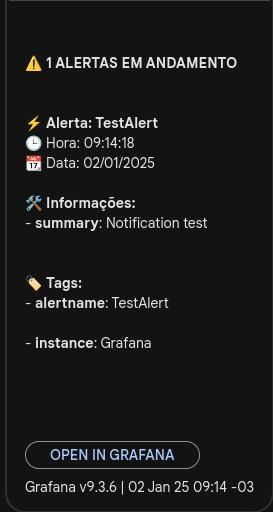
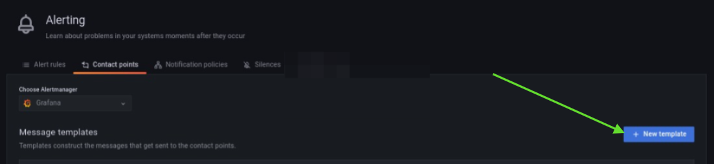

# Configuração de Alertas no Grafana v9.3.6

Olá, meu nome é Antônio Gabriel, meu objetivo com esse material é trazer de forma simples um guia prático para configurar **Contact Points**, **Notification Policies**, **Alert Rules** e **Templates de Alerta** no Grafana v9.3.6. Siga as etapas para criar um sistema de alertas eficiente e personalizado.

---

## 1. Configuração de Contact Points

Os **Contact Points** definem o canal onde os alertas serão enviados, como Google Chat, Telegram ou Email.

### Passos:

1. Acesse a seção **Contact Points** no Grafana.
2. Clique em **"New Contact Point"**.
3. Insira um nome para o Contact Point.
4. Escolha o tipo desejado:
   - Para Webhook do Google Chat, selecione **"Google Chat"**.
5. Salve o Contact Point.

---

## 2. Configuração de Notification Policies

As **Notification Policies** definem as regras de roteamento que conectam as Alert Rules aos Contact Points.

### Passos:

1. Vá para a seção **Notification Policies**.
2. Clique em **"New Policy"**.
3. Configure:
   - **Contact Point**: Escolha o Contact Point criado anteriormente.
4. Salve a política.

---

## 3. Criação de Alert Rules

As **Alert Rules** configuram as condições que disparam os alertas.

### Passos:

1. Vá para a seção **Alert Rules**.
2. Clique em **"+ New Alert Rule"**.
3. Configure os seguintes campos:
   - **Set a query and alert condition**:
     - Escolha a fonte de dados (ex.: Prometheus, Loki).
     - Configure e execute a consulta.
   - **Alert evaluation behavior**:
     - Avaliação a cada X minutos (ex.: 1 minuto).
     - Tempo mínimo para disparo (ex.: 5 minutos).
   - **Add details for your alert**:
     - Nome, pasta, grupo e resumo do alerta.
   - **Notifications**:
     - Vincule ao Contact Point e Notification Policy configurados anteriormente, assim podemos informar qual Contact Point o alerta irá usar.
4. Salve as regras.

---

## 4. Criando Templates de Alerta

### Modelo das notificações que iremos usar
Os templates personalizam o formato das mensagens enviadas pelos alertas, com o Template que forneci esse será o modelo das nossas notificações, lembrando que você pode editar como quiser.



### Criando Template:



#### Passos:

1. Vá para **Contact Points**.
2. Clique em **"+ New Template"**.
3. Nomeie o template e insira o código no campo de edição.

### Exemplo de Template:

```go
{{ define "custom_alert_template" }}
{{ range . }}
{{ if eq .Status "firing" }}⚡{{ else }}✔️{{ end }} <b>Alerta: {{ index .Labels "alertname" }}</b>
🕒 Hora: {{ .StartsAt.Format "15:04:05" }}
📆 Data: {{ .StartsAt.Format "02/01/2006" }}
{{ if gt (len .Annotations) 0 }}
🛠️ <b>Informações:</b>
{{- range .Annotations.SortedPairs }}
    - <b>{{ .Name }}</b>: {{ .Value }}
{{- end }}
{{ end }}
{{ if gt (len .Labels) 0 }}
🏷️ <b>Tags:</b>
{{- range .Labels.SortedPairs }}
    - <b>{{ .Name }}</b>: {{ .Value }}
{{ end }}
{{ end }}
{{ end }}
{{- end }}

{{ define "custom_alert_notification" }}
{{ if gt (len .Alerts.Firing) 0 }}
⚠️ <b>{{ len .Alerts.Firing }} ALERTAS EM ANDAMENTO</b>
{{ template "custom_alert_template" .Alerts.Firing }}
{{ end }}
{{ if gt (len .Alerts.Resolved) 0 }}
✅ <b>{{ len .Alerts.Resolved }} ALERTAS RESOLVIDOS</b>
{{ template "custom_alert_template" .Alerts.Resolved }}
{{ end }}
{{- end }}
```


## Observação Importante sobre Templates no Grafana Alertmanager

Ao criar um template no **Grafana Alertmanager**, o nome utilizado para chamar o template no **Contact Point** é aquele definido na última camada de definição. Geralmente, este é o template que engloba as chamadas internas de outros subtemplates.

### Exemplo:
- O template `custom_alert_template` é um subtemplate utilizado internamente dentro do template principal `custom_alert_notification`.
- Ele é responsável por formatar partes específicas das mensagens.

Portanto, o **template principal** que deve ser referenciado no **Contact Point** é o `custom_alert_notification`.


---

## 5. Agora vamos definir esse template no nosso contact point:

- Vá até as configurações do Contact Point criado.
- No campo "Message" use o nome do template principal no Contact Point, basta copiar e colar como está abaixo:
```
{{ template "custom_alert_notification" . }}
```

- Agora basta realizar um Teste, no próprio espaço do Contact Point é possível realziar o teste do seu Template.

---

Pronto! Agora você tem um sistema de alertas configurado e funcionando no Grafana. 🚀

Se este guia foi útil, compartilhe com a comunidade! 😊
